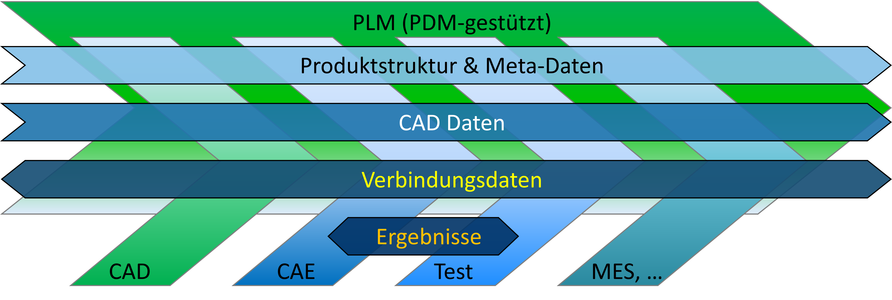

# 2017-04-06 Forum "Simulation in der Automobilindustrie"

## Nutzen der Standards &chi;MCF und FATXML in der CAE-Prozesskette

These slides were presented at the
26th Forum "Simulation in der Automobilindustrie" 
hosted at Georg Fischer Automotive AG in Schaffhausen, Switzerland at 2017-04-06

DOI: [10.13140/RG.2.2.13285.82403](http://dx.doi.org/10.13140/RG.2.2.13285.82403) 

### Abstract

Effiziente und verlässliche Simulationsprozesse erfordern eine ebenso effiziente, verlässliche und automatisierbare Versorgung mit Daten aus Nachbarprozessen (Konzeption/Auslegung, Konstruktion, Erprobung, …). Sie erfordern selbstverständlich auch eine entsprechende Durchgängigkeit der Daten zwischen den einzelnen Abschnitten dieser Simulationsprozesse (Pre-Processing, Solving, Post-Processing) und ggf. auch den einzelnen Prozessschritten (Vernetzung, Assembly, Massenabgleich, …). 

Die Herausforderung ergibt sich hierbei aus der Vielzahl unterschiedlichster beteiligter Software-Systeme. 

Etwa im Zeitraum seit der Ablösung von CATIA V4 durch V5 und dem Siegeszug von JT wurde diese Herausforderung bezogen auf CAD-Daten (Bauteilgeometrie) weitestgehend gelöst: Zum einen wurde die Qualität der CAD-Daten (Numerik, Topologie) deutlich besser, und zum anderen etablierte sich JT als standardisiertes und doch leichtgewichtiges und flexibles Austauschformat. 

CAD-Daten stellen aber nur einen von mehreren wesentlichen Datenpfaden dar: 

Zum Glück hat es in den letzten Jahren aber auch bzgl. der bisher unterrepräsentierten Pfade „Produktstruktur & Meta-Daten“ und „Verbindungsdaten“ deutliche Fortschritte gegeben. Hier treten die neuen VDA-Standards „FATXML“ und „&chi;MCF“ ins Rampenlicht. 

Der Vortrag stellt die Leistungsfähigkeit und andere zentrale Eigenschaften der Standards dar, um darauf aufbauend ihr Nutzungspotential zu umreißen. Er geht auf den Stand der Arbeiten in den beteiligten VDA FAT AKs 27 und 25 ein und typisiert den Umsetzungsgrad in relevanten Software-Systemen. 

## Folder Contents

* [the slide set: _PROSTEP_Franke_xMCF+FATXML_20170406__ohne_Firmenpräsentation.pdf_](./PROSTEP_Franke_xMCF+FATXML_20170406__ohne_Firmenpräsentation.pdf)